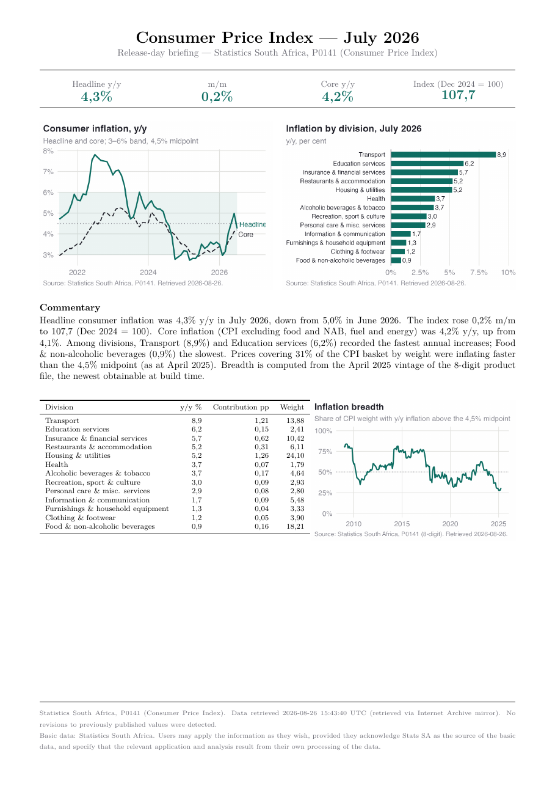

# sa-macro-brief

**One command turns a Stats SA release into a one-page PDF briefing note —
the work a junior bank economist does by hand in the hour after the embargo
lifts.**



## The problem

On release day, the useful numbers are scattered: CPI index levels live in a
zipped spreadsheet with no growth rates, GDP ships levels only, the QLFS is a
141-page PDF with decimal commas and wrapped table rows. Turning them into
"headline 4,3% y/y, down from 5,0%; transport contributed 1,2 pp" is an hour
of error-prone copy-work under time pressure. This pipeline does that hour in
seconds, with every number traceable to a source file, a retrieval timestamp
and a named integrity check.

```bash
./sa-brief cpi  --period 2026-07
./sa-brief ppi  --period 2026-06
./sa-brief gdp  --period 2026Q1
./sa-brief qlfs --period 2026Q2
./sa-brief calendar
```

Each command fetches (or reuses the cached copy of) the release artefacts,
recomputes the analytical aggregates, and writes a one-page A4 PDF to
`output/` with charts, rule-based commentary, a data table and a sourced
footer. Two runs over the same inputs produce byte-identical PDFs.

## What it computes — and the definitional choices

- **Growth rates** from index levels, under a strict one-symbol-one-meaning
  contract: `m/m` and `y/y` in per cent; GDP's headline is **q/q seasonally
  adjusted and *not* annualised** (the levels in `QRS1000` are annualised;
  the growth rate computed from them is not — the release's own convention);
  changes in rates are **percentage points (pp)**, never "%".
- **Core CPI** is Stats SA's published series (`CPS00014`, CPI excluding
  food and NAB, fuel and energy) — never reconstructed.
- **Unemployment is reported as LU1 *and* LU3** (33,6% and 43,8% in
  Q2 2026). LU3 is deliberately not called the "expanded unemployment
  rate" — it is the nearest analogue under the post-Q3:2025 ICLS framework,
  not identically defined. Reporting either alone misrepresents the South
  African labour market.
- **Inflation breadth** (not published by Stats SA): the share of CPI weight
  inflating faster than the 4,5% target midpoint, computed monthly from the
  8-digit product file's weights — it catches a headline falling only
  because one volatile category collapsed.
- **Contributions, reconciled**: division contributions to CPI y/y are
  computed from weight × index change and asserted against the release PDF's
  Table C (July 2026: every published division within 0,05 pp). GDP industry
  contributions must sum to the headline or the run aborts (Q1 2026:
  0,545 = 0,545).
- **Revisions and vintages**: every download is stamped with retrieval time;
  historical values that change between releases are flagged in the output
  ("revised from X to Y"), and GDP first-print movement accumulates across
  vintages.
- **Series breaks are handled, not smoothed over**: the CPI Dec 2024 rebase,
  the PPI Dec 2023 rebase, the QLFS Q3:2025 questionnaire revision (under
  which informality estimates are only comparable from Q3:2025 — earlier
  comparisons are suppressed, not computed), and the pending GDP rebasing to
  a 2022 base year (the concordance sheet is loaded on every run in
  preparation).
- Seasonal adjustment is always Stats SA's own; the pipeline never adjusts
  anything itself.

## Install and run

Requires R ≥ 4.3, the Quarto CLI (≥ 1.4; auto-detected from an RStudio
install if not on `PATH`) and a TeX distribution
(`Rscript -e 'tinytex::install_tinytex()'` once).

```bash
git clone <this repo> && cd sa-macro-brief
Rscript -e 'install.packages("renv"); renv::restore()'
./sa-brief cpi --period 2026-07
```

Tests (they run the readers against the cached release files and the
known-good release values):

```bash
Rscript -e 'testthat::test_dir("tests")'
```

A `targets` pipeline (`_targets.R`) rebuilds all four briefs:
`Rscript -e 'targets::tar_make()'`.

## Sources, caveats, limitations

Basic data: Statistics South Africa — publication pages and time-series
spreadsheets, scraped and cached politely (1 request/second, descriptive
User-Agent, exponential backoff, nothing parallelised). Artefact filenames
are never constructed: releases get re-versioned (`_v2`, `_v3`) after
corrections, and a `_v3` is surfaced as a revision signal. When the Stats SA
site's bot protection blocks non-browser clients (it does on some networks),
the fetcher falls back to the Internet Archive's copy of the same URL and
records that provenance in the vintage metadata and the PDF footer — it never
attempts to bypass the protection. Details and every judgement call:
[docs/METHODOLOGY.md](docs/METHODOLOGY.md),
[docs/DATA_SOURCES.md](docs/DATA_SOURCES.md),
[docs/DECISIONS.md](docs/DECISIONS.md),
[docs/OPEN_QUESTIONS.md](docs/OPEN_QUESTIONS.md).

Known limitations: the QLFS parser is landmark-based over PDF text and would
need re-anchoring if Stats SA redesigns the tables; the breadth series
currently ends at the newest obtainable vintage of the 8-digit file; LU3
history begins Q3:2025 by construction.

*Basic data: Statistics South Africa. Users may apply the information as they
wish, provided they acknowledge Stats SA as the source of the basic data, and
specify that the relevant application and analysis result from their own
processing of the data.*
