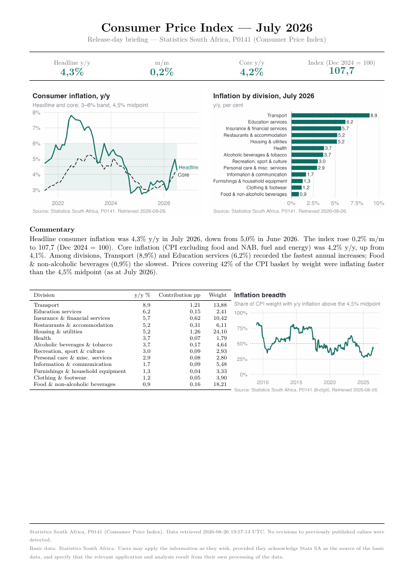
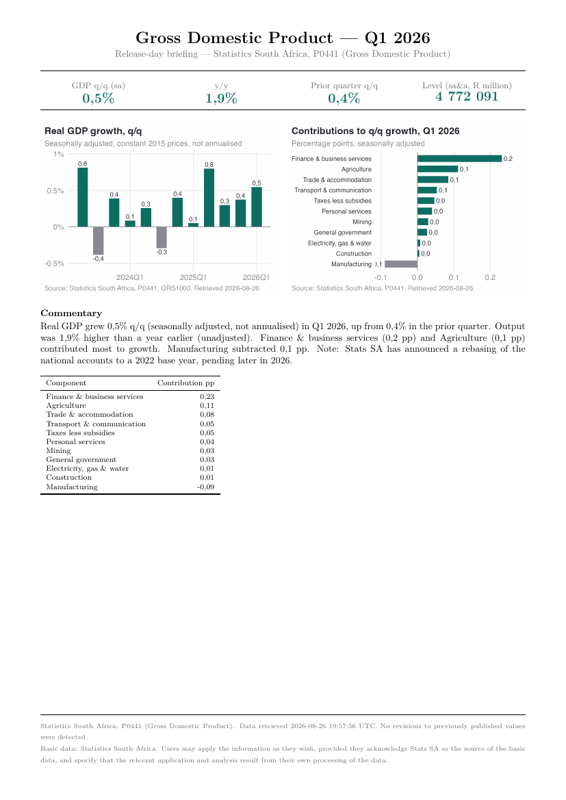

# sa-macro-brief

[](https://github.com/reinhardlaaksofficial-hub/sa-macro-brief/actions/workflows/tests.yml)
[](https://github.com/reinhardlaaksofficial-hub/sa-macro-brief/actions/workflows/watch.yml)
[](LICENSE)

**A one-page macro briefing note, delivered to Slack minutes after
Statistics South Africa publishes.**

Covers the four releases a South African macro desk waits for: CPI, PPI, GDP
and the Quarterly Labour Force Survey. It does in ~25 seconds what a junior
economist does by hand in the hour after the embargo lifts.

Reinhard Laaks, University of Pretoria.

| CPI | GDP |
|---|---|
| [](docs/examples/cpi_202607.pdf) | [](docs/examples/gdp_2026Q1.pdf) |

*Real output. More in [`docs/examples/`](docs/examples/); newly published
briefings are archived automatically to [`briefs/`](briefs/).*

## Quick start — pick one

**A. Get briefings automatically on release day**

The schedule and delivery run on GitHub Actions; the *fetch* has to run from
a network Stats SA serves (see [Where it can run](#where-it-can-run) — their
bot protection blocks GitHub's shared runners). So:

1. Fork this repository.
2. Register a **self-hosted runner**: *Settings → Actions → Runners → New
   self-hosted runner*, and follow the shown commands on any machine that can
   reach statssa.gov.za — a spare desktop, an office box, a small VPS. Then
   in `.github/workflows/watch.yml` change `runs-on: ubuntu-latest` to
   `runs-on: self-hosted`.
3. *(optional)* **Settings → Secrets and variables → Actions → New secret**,
   named `SLACK_WEBHOOK_URL`, set to a Slack
   [incoming webhook](https://api.slack.com/messaging/webhooks).

GitHub then handles scheduling, logging, retention and Slack delivery, while
the machine you registered does the fetching. If a run breaks — Stats SA
renames a file, or changes a table — it says so loudly, because a briefing
that silently fails to arrive is worse than an error.

If you would rather not involve GitHub at all,
`./deploy/install-schedule.sh install` sets up launchd (macOS) or cron
(Linux) directly on one machine. That path is verified working.

**B. Build one right now (30 seconds, nothing installed)**

Actions tab → **Build a briefing** → *Run workflow* → choose a release and
period → download the PDF from the run's artifacts. On GitHub's shared
runners this serves *already-archived* releases via the Internet Archive
fallback, which is fine for trying it out or rebuilding a past period, but
is not a substitute for release-day capture.

**C. Run it locally**

```bash
git clone https://github.com/reinhardlaaksofficial-hub/sa-macro-brief && cd sa-macro-brief
Rscript -e 'install.packages("renv"); renv::restore()'
./sa-brief cpi --period 2026-07
```

Needs R ≥ 4.3, Quarto and a TeX install
(`Rscript -e 'tinytex::install_tinytex()'` once). To schedule it on your own
machine instead of GitHub, see [Scheduled operation](#scheduled-operation).

## The problem

On release day, the useful numbers are scattered: CPI index levels live in a
zipped spreadsheet with no growth rates, GDP ships levels only, the QLFS is a
141-page PDF with decimal commas and wrapped table rows. Turning them into
"headline 4,3% y/y, down from 5,0%; transport contributed 1,2 pp" is an hour
of error-prone copy-work under time pressure. This pipeline does that hour in
seconds, with every number traceable to a source file, a retrieval timestamp
and a named integrity check.

```bash
./sa-brief cpi  --period 2026-07
./sa-brief ppi  --period 2026-06
./sa-brief gdp  --period 2026Q1
./sa-brief qlfs --period 2026Q2
./sa-brief calendar
```

Each command fetches (or reuses the cached copy of) the release artefacts,
recomputes the analytical aggregates, and writes a one-page A4 PDF to
`output/` with charts, rule-based commentary, a data table and a sourced
footer. Two runs over the same inputs produce byte-identical PDFs.

## What it computes — and the definitional choices

- **Growth rates** from index levels, under a strict one-symbol-one-meaning
  contract: `m/m` and `y/y` in per cent; GDP's headline is **q/q seasonally
  adjusted and *not* annualised** (the levels in `QRS1000` are annualised;
  the growth rate computed from them is not — the release's own convention);
  changes in rates are **percentage points (pp)**, never "%".
- **Core CPI** is Stats SA's published series (`CPS00014`, CPI excluding
  food and NAB, fuel and energy) — never reconstructed.
- **Unemployment is reported as LU1 *and* LU3** (33,6% and 43,8% in
  Q2 2026). LU3 is deliberately not called the "expanded unemployment
  rate" — it is the nearest analogue under the post-Q3:2025 ICLS framework,
  not identically defined. Reporting either alone misrepresents the South
  African labour market.
- **Inflation breadth** (not published by Stats SA): the share of CPI weight
  inflating faster than the 4,5% target midpoint, computed monthly from the
  8-digit product file's weights — it catches a headline falling only
  because one volatile category collapsed.
- **Contributions, reconciled**: division contributions to CPI y/y are
  computed from weight × index change and asserted against the release PDF's
  Table C (July 2026: every published division within 0,05 pp). GDP industry
  contributions must sum to the headline or the run aborts (Q1 2026:
  0,545 = 0,545).
- **Revisions and vintages**: every download is stamped with retrieval time;
  historical values that change between releases are flagged in the output
  ("revised from X to Y"), and GDP first-print movement accumulates across
  vintages.
- **Series breaks are handled, not smoothed over**: the CPI Dec 2024 rebase,
  the PPI Dec 2023 rebase, the QLFS Q3:2025 questionnaire revision (under
  which informality estimates are only comparable from Q3:2025 — earlier
  comparisons are suppressed, not computed), and the pending GDP rebasing to
  a 2022 base year (the concordance sheet is loaded on every run in
  preparation).
- Seasonal adjustment is always Stats SA's own; the pipeline never adjusts
  anything itself.

## Tests

Tests run **offline** against small committed fixtures — cloning this repo
never downloads from, or repeatedly hits, a government statistics server:

```bash
Rscript -e 'testthat::test_dir("tests")'
```

The fixtures are derived extracts preserving the real published values the
assertions check (regenerate with `Rscript data-raw/make-fixtures.R`). A
separate opt-in suite verifies the live site still serves what the pipeline
expects:

```bash
SA_BRIEF_LIVE_TESTS=true Rscript -e 'testthat::test_dir("tests")'
```

A `targets` pipeline (`_targets.R`) rebuilds all four briefs:
`Rscript -e 'targets::tar_make()'`.

## Sources, caveats, limitations

Basic data: Statistics South Africa — fetched live from statssa.gov.za and
cached politely (1 request/second, descriptive User-Agent, exponential
backoff, nothing parallelised). Every brief in `output/` was built from files
this tool downloaded directly from Stats SA.

Artefact discovery runs a ladder, because filenames must never be assumed:
it first scrapes the publication page and takes its links verbatim; if that
page is unreachable it probes the known filename variants with HEAD requests
and uses only what the server confirms exists, newest correction first. That
is how it picks `GDP … Q1 2026_v2.xlsx` on its own — the un-suffixed name
now 404s, having been superseded — and how a `_v3` gets surfaced as a
revision signal. Stats SA's bot protection challenges the site's HTML pages
from some networks (it does from mine) while serving the data files
normally; the tool detects that challenge so it can never be mistaken for
content, never attempts to answer or bypass it, and never accepts a mirrored
copy of a *discovery* page, since stale links are worse than none. Details
and every judgement call:
[docs/METHODOLOGY.md](docs/METHODOLOGY.md),
[docs/DATA_SOURCES.md](docs/DATA_SOURCES.md),
[docs/DECISIONS.md](docs/DECISIONS.md),
[docs/OPEN_QUESTIONS.md](docs/OPEN_QUESTIONS.md).

<a name="where-it-can-run"></a>
### Where it can run

Stats SA sits behind Imperva bot protection. Measured, not assumed:

| Client | Data files (`.xlsx`, `.zip`, `.pdf`) | HTML pages |
|---|---|---|
| Ordinary home/office connection | served normally | challenged |
| GitHub-hosted Actions runner | **challenged** | challenged |

So GitHub's shared runners cannot fetch a release directly. They fall back to
the Internet Archive, which is fine for a release that has already been
archived, but **useless on release day**: a file published minutes ago is in
no archive. Release-day capture therefore has to run from a network Stats SA
serves — your own machine, an office box, or a self-hosted Actions runner.
The bot check is never answered or bypassed; it is detected, disclosed in the
PDF footer as "retrieved via Internet Archive mirror", and recorded in each
file's vintage sidecar, so provenance is never laundered.

This also matters because Stats SA keeps only the **current** vintage of the
CPI/PPI timeseries files — last month's zip is already a 404. A release day
you do not capture is gone from the live site permanently, which is why the
watcher polls through the embargo window.

### Status and honest limitations

Every figure the tests assert has been checked against Stats SA's published
values, but **each release type has so far been validated against a single
period** (July 2026 CPI, June 2026 PPI, Q1 2026 GDP, Q2 2026 QLFS). The
scheduled watcher has been verified end to end by simulating a new release;
it has not yet lived through an actual Stats SA publication transition. Treat
"works on release day" as a design claim backed by tests, not as an observed
year of production use.

Other limitations: the QLFS parser is landmark-based over PDF text and would
need re-anchoring if Stats SA redesigns the tables; probe-based discovery
depends on a list of naming variants observed in Stats SA's own links, and a
genuinely new shape fails loudly with the probed candidates listed rather
than silently; LU3 history begins Q3:2025 by construction.

*Basic data: Statistics South Africa. Users may apply the information as they
wish, provided they acknowledge Stats SA as the source of the basic data, and
specify that the relevant application and analysis result from their own
processing of the data.*

## Scheduled operation

<a name="scheduled-operation"></a>
Prefer GitHub Actions (Quick start A) — it needs no machine of your own.
To schedule on your own hardware instead:

The watcher polls rather than firing at a fixed instant, because Stats SA's
publication dates move within the month:

```bash
./deploy/install-schedule.sh install    # user launchd agent, no sudo
./deploy/install-schedule.sh status
./deploy/install-schedule.sh uninstall
```

On macOS this installs a launchd user agent; on Linux, cron entries. (On
Windows, point Task Scheduler at `deploy/watch.sh` via WSL or call
`sa-brief watch` directly.) It runs on weekdays at 09:05, 10:05, 11:40 and 13:05 SAST, straddling the
10:00 (CPI) and 11:30 (PPI, GDP, QLFS) embargoes. Each pass asks one
question per release — *is the newest completed period still unbuilt, and is
its file on the server?* — then builds only that. It is idempotent, so extra
polls cost four HEAD requests and nothing else. Results append to
`output/logs/watch.log`. Run `./sa-brief watch --dry-run` to see what it
would do without fetching.

Note that Stats SA keeps only the **current** vintage of the CPI/PPI
timeseries files: last month's zip is already a 404. Missing a release day
means that vintage is gone from the live site, which is why the watcher polls
through the embargo window and why the archive fallback is retained.

## Notifications

Off by default. `config/notify.yaml` enables Slack (an incoming webhook, with
the URL read from an environment variable so no secret enters the repo) and
email (handed to a mail command you configure, so authentication stays
yours). When enabled, a completed brief posts its headline figures and first
commentary line.
